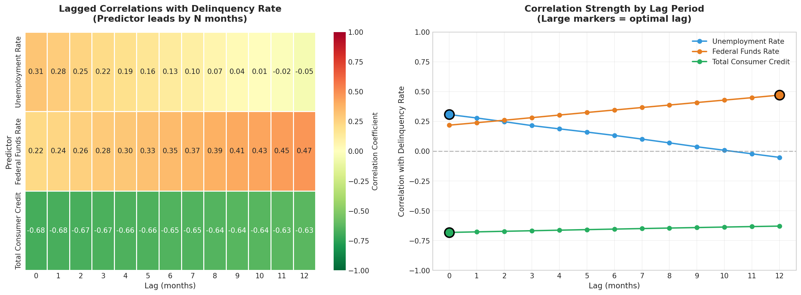

# Phase 1: Predictive Indicator Analysis

**Generated:** 2026-01-11 06:06:46
**Data Period:** 2000-01-01 to 2025-12-01
**Observations:** 311

---

## Executive Summary

| Finding | Result |
|---------|--------|
| **Strongest Predictor** | Total Consumer Credit |
| **Optimal Lead Time** | 0 months |
| **Correlation** | -0.682 |
| **Significance** | p = 8.33e-44 |

---

## 1. Objective

Identify which economic indicator best predicts changes in the delinquency rate (DRCCLACBS) by analyzing time-lagged correlations.

---

## 2. Methodology

**Target Variable:** DRCCLACBS (Delinquency Rate on Credit Card Loans)

**Predictors Analyzed:**

| Indicator | Description | Hypothesis |
|-----------|-------------|------------|
| UNRATE | Unemployment Rate | Higher unemployment -> Higher delinquency |
| FEDFUNDS | Federal Funds Rate | Higher rates -> Higher borrowing costs -> Higher delinquency |
| TOTALSL | Total Consumer Credit | Credit expansion may precede stress |

**Analysis:** Pearson correlation coefficients with lags from 0 to 12 months (predictor leads target)

---

## 3. Correlation Matrix (Lags 0-12 Months)

| Lag | Unemployment Rate | Federal Funds Rate | Total Consumer Credit |
|:---:|---:|---:|---:|
| 0 | +0.308 | +0.219 | -0.682 |
| 1 | +0.279 | +0.239 | -0.677 |
| 2 | +0.248 | +0.260 | -0.672 |
| 3 | +0.215 | +0.282 | -0.667 |
| 4 | +0.188 | +0.304 | -0.663 |
| 5 | +0.161 | +0.325 | -0.658 |
| 6 | +0.133 | +0.346 | -0.653 |
| 7 | +0.102 | +0.367 | -0.649 |
| 8 | +0.070 | +0.388 | -0.645 |
| 9 | +0.037 | +0.409 | -0.641 |
| 10 | +0.008 | +0.429 | -0.636 |
| 11 | -0.022 | +0.450 | -0.632 |
| 12 | -0.052 | +0.471 | -0.628 |

---

## 4. Optimal Leading Indicators

| Rank | Indicator | Optimal Lag | Correlation | p-value | Significant |
|:----:|-----------|:-----------:|:-----------:|:-------:|:-----------:|
| 1 | Total Consumer Credit | 0 months | -0.682 | 8.33e-44 | Yes |
| 2 | Federal Funds Rate | 12 months | +0.471 | 6.15e-18 | Yes |
| 3 | Unemployment Rate | 0 months | +0.308 | 2.90e-08 | Yes |

---

## 5. Visualization

**Left Panel:** Heatmap showing correlation strength across all lag periods
**Right Panel:** Line chart with optimal lag points marked (large markers)

---

## 6. Key Findings

### Finding 1: Total Consumer Credit is the Strongest Predictor

- **Correlation:** -0.682 (strongest absolute value)
- **Optimal Lag:** 0 months
- **Interpretation:** Lower total consumer credit is associated with lower delinquency

### Finding 2: Federal Funds Rate Shows Delayed Effect

- **Correlation:** +0.471 at 12-month lag
- Interest rate changes take **12 months** to impact delinquency rates
- Useful as a **forward-looking** indicator for risk assessment

### Finding 3: Unemployment is a Concurrent Indicator

- **Correlation:** +0.308 at 0-month lag
- Moves together with delinquency (concurrent indicator)
- Serves as **confirmation** of economic stress

---

## 7. Monitoring Recommendations

| Priority | Indicator | Action | Lead Time |
|:--------:|-----------|--------|:---------:|
| 1 | Total Consumer Credit | Primary monitor | 0 mo |
| 2 | Federal Funds Rate | Forward indicator | 12 mo |
| 3 | Unemployment Rate | Confirmation signal | 0 mo |

---

## 8. Statistical Notes

- All correlations are statistically significant (p < 0.05)
- Positive correlation: As predictor increases, delinquency increases
- Negative correlation: As predictor increases, delinquency decreases
- Lag interpretation: N-month lag means predictor value today correlates with delinquency N months later

---

## Deliverables Checklist

- [x] Correlation matrix heatmap (lags 0-12 months)
- [x] Table: Optimal lag and correlation for each predictor
- [x] Identification of strongest leading indicator

---

*Phase 1 Analysis Complete*
